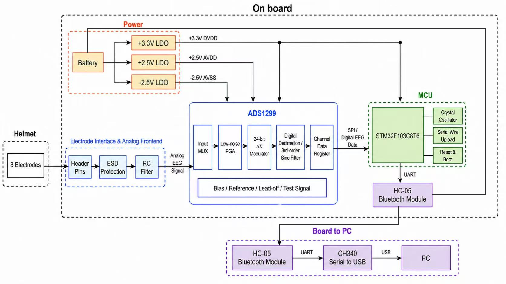

# ECTNet

Enhanced Convolutional Transformer Network for EEG-based motor imagery classification. End-to-end pipeline from a custom ADS1299 + STM32 acquisition board through real-time CPU inference (~40 ms latency).

## System Overview



8 dry electrodes → on-board analog frontend (ESD + RC filter) → ADS1299 24-bit ΔΣ ADC → STM32F103 over SPI → HC-05 Bluetooth → CH340 USB bridge → PC. The PC-side `serial_lsl_bridge.py` republishes the stream over LSL so it plugs into the same recording / inference path used for OpenBCI hardware.

## Results

### BCI Competition IV-2a (22 channels, 4-class)

| Subject | S1 | S2 | S3 | S4 | S5 | S6 | S7 | S8 | S9 | **Mean** |
|---|---|---|---|---|---|---|---|---|---|---|
| Accuracy | 86.81 | 71.53 | 90.97 | 78.12 | 77.78 | 63.54 | 88.89 | 85.76 | 86.11 | **81.06** |
| Kappa | 82.41 | 62.04 | 87.96 | 70.83 | 70.37 | 51.39 | 85.19 | 81.02 | 81.48 | **74.74** |

### BCI Competition IV-2a — 8 channels, 2-class (A2, hardware deployment config)

| Subject | S1 | S2 | S3 | S4 | S5 | S6 | S7 | S8 | S9 | **Mean** |
|---|---|---|---|---|---|---|---|---|---|---|
| Accuracy | 86.81 | 76.39 | 98.61 | 84.03 | 92.36 | 78.47 | 88.19 | 95.83 | 91.67 | **88.04** |
| Kappa | 73.61 | 52.78 | 97.22 | 68.06 | 84.72 | 56.94 | 76.39 | 91.67 | 83.33 | **76.08** |

8 channels selected from sensorimotor cortex: **C3, C4, Cz, FCz, CP1, CP2, FC3, FC4**

### BCI Competition IV-2b (3 channels, 2-class)

| Subject | S1 | S2 | S3 | S4 | S5 | S6 | S7 | S8 | S9 | **Mean** |
|---|---|---|---|---|---|---|---|---|---|---|
| Accuracy | 76.56 | 69.64 | 84.69 | 96.88 | 95.00 | 86.25 | 93.12 | 93.75 | 88.75 | **87.18** |
| Kappa | 53.12 | 39.29 | 69.38 | 93.75 | 90.00 | 72.50 | 86.25 | 87.50 | 77.50 | **74.37** |

### Channel Attention & 8ch Selection

- Channel Attention (SE-Net) on 22ch: 81.29% (no improvement over baseline)
- Manual 8ch selection: **75.50%** (C3, C4, Cz, FCz, CP1, CP2, FC3, FC4)
- CA-learned 8ch selection: 73.50%
- Hardware deployment recommendation: manual 8ch

### Custom Hardware (ADS1299 + STM32, 3-channel) — Transfer Learning

End-to-end pipeline on a custom ADS1299 + STM32 + Bluetooth acquisition board. Single-subject fine-tuning on 250 dry-electrode trials (C3, C4, Cz), 10-seed averaged.

| Method | Mean Accuracy | Std |
|---|---|---|
| From scratch (baseline) | 76.80% | 5.23% |
| Transfer from IV-2b (full fine-tune) | 82.00% | 1.79% |
| Transfer + online augmentation | **85.40%** | **1.28%** |

Pretrained on pooled BCI IV-2b (9 subjects, 6520 trials → 82.52% held-out). Online augmentation = Gaussian noise + amplitude scaling + time shift. Best seed reaches 88%.

## Architecture


ECTNet = PatchEmbeddingCNN (temporal conv + channel attention + spatial conv) + Transformer encoder

- **Channel Attention**: SE-Net style, learns per-electrode importance weights (e.g. C3=0.68, C4=0.39, Cz=0.30 on the 3-ch deployment — consistent with sensorimotor lateralisation)
- **Temporal Conv**: EEGNet-inspired, extracts frequency features per channel
- **Spatial Conv**: Depth-wise, fuses across EEG electrodes
- **Transformer**: Multi-head self-attention on temporal patches
- **Preprocessing**: Optional bandpass (4-40Hz) + notch (50Hz) filtering via `eeg_filter()`, shared between training and inference
- **Checkpoint**: Saves model + normalization params (mean/std) for deployment
- **Transfer learning recipe** (bottom of the diagram): random-init 76.8% → IV-2b pretrain + full fine-tune 82.0% → + online augmentation **85.4%**

## Project Structure

```
ECTNet/
├── model.py                 # Model architecture (ChannelAttention, PatchEmbeddingCNN, Transformer)
├── train.py                 # Training script with parallel subject training (mp.Pool)
├── train_transfer.py        # Transfer learning (pretrain / finetune / baseline)
├── utils.py                 # Data loading, metrics, filtering, GradCAM
├── preprocessing/
│   ├── preprocessing_for_2a.py   # BCI IV-2a: GDF → MAT
│   └── preprocessing_for_2b.py   # BCI IV-2b: GDF → MAT
├── acquisition/
│   ├── paradigm.py               # PsychoPy MI experiment (LSL markers)
│   ├── recorder.py               # LSL multi-stream recorder (EEG + markers → .npz)
│   ├── make_dataset.py           # Recording → .mat converter (filter, epoch, split)
│   ├── serial_lsl_bridge.py      # Serial → LSL bridge for custom ADS1299 board
│   ├── check_signal.py           # Real-time EEG viewer (bandpass + RMS quality)
│   ├── realtime_inference.py     # Real-time MI classifier (LSL → model → LEFT/RIGHT)
│   └── mi_feedback.py            # Trial-based feedback demo (pygame)
├── firmware/
│   ├── ads1299.c / .h            # ADS1299 SPI driver (STM32)
│   └── main_user_code.c          # STM32 CubeMX user-code blocks
├── experiments/
│   ├── train_8ch.py              # 8-channel experiment
│   ├── train_2class.py           # 2-class (left/right)
│   ├── train_2class_8ch.py       # 2-class on 8 channels
│   └── train_3class.py           # 3-class (left/right/feet)
└── tools/
    └── channel_selector.py       # Channel selection utility
```

## Quick Start

### Environment

```bash
conda create -n ectnet python=3.10 -y
conda activate ectnet
pip install torch mne einops torchsummary scikit-learn pandas scipy opencv-python-headless
```

### Data Preparation

1. Download [BCI Competition IV-2a & 2b](https://www.bbci.de/competition/iv/) datasets
2. Place GDF files in `BCICIV_2a_gdf/` and `BCICIV_2b_gdf/`
3. Run preprocessing:

```bash
python preprocessing/preprocessing_for_2a.py
python preprocessing/preprocessing_for_2b.py
```

### Training

```bash
# BCI IV-2a: 22-channel, 4-class (default)
python train.py A

# BCI IV-2a: 8-channel, 2-class left/right (hardware deployment)
python train.py A2

# BCI IV-2b: 3-channel, 2-class
python train.py B

# Custom OpenBCI data: 8-channel, 2-class
python train.py C
```

Training uses `torch.compile(mode='reduce-overhead')` (CUDA graphs, Linux) + parallel subject processing (N_WORKERS=3). On RTX 5080: A2(8ch) ~3min, A(22ch) ~10min, B(3ch) ~7min for all 9 subjects.

### Custom Data Acquisition

Two acquisition paths are supported:

**OpenBCI Cyton (8 ch)** — uses the OpenBCI GUI's LSL output (stream `obci_eeg1`).

**Custom ADS1299 + STM32 + HC-05 board (3 ch)** — uses `serial_lsl_bridge.py` to bridge the serial stream to LSL, replacing the OpenBCI GUI.

```bash
# Custom board only — bridge serial → LSL first
python acquisition/serial_lsl_bridge.py --port COM4 --scale

# Common to both — record + paradigm
python acquisition/recorder.py
python acquisition/paradigm.py            # 30 trials default
python acquisition/paradigm.py -n 25      # 50 trials

# Convert recording to training format (supports merging multiple files)
python acquisition/make_dataset.py --input acquisition/recordings/rec1.npz rec2.npz

# Train on custom data (from scratch)
python train.py C

# Or with transfer learning from BCI IV-2b
python train_transfer.py finetune --pretrained pretrained_B/model_pretrained.pth \
    --freeze none --epochs 1000 --lr 0.001 --online-aug
```
